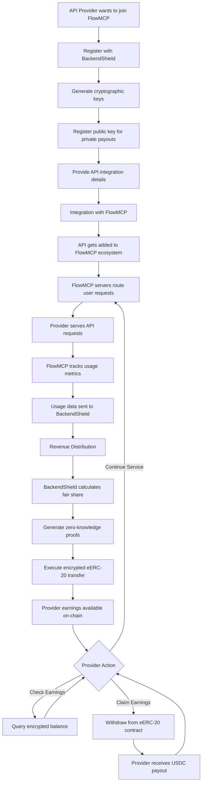
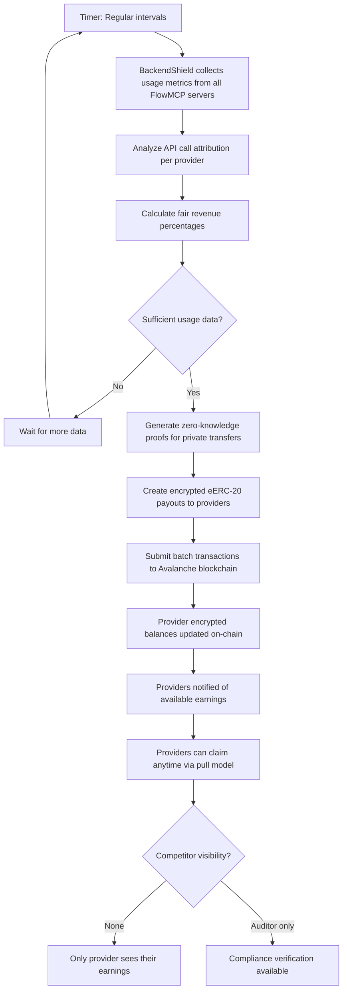

# BackendShield Provider Revenue Distribution Flows

## Overview
This document shows the API provider registration journey, usage tracking process, and automated revenue distribution in the BackendShield system for fair FlowMCP provider compensation.

## Provider Flow Diagram

### Main Provider Journey

### Automated Revenue Distribution Process

## Flow Details

### 1. Provider Registration (One-time Setup)
- **Trigger**: API provider wants to join FlowMCP ecosystem
- **Process**: Generate keys, register with PrivateShare, integrate with API platform
- **Privacy**: Provider identity registered but earnings will be encrypted
- **Result**: Provider ready to receive private revenue distribution

### 2. API Usage Tracking (Continuous)
- **Trigger**: Users make API requests through API platforms
- **Attribution**: API platforms track which provider served each request
- **Metrics**: Usage data (calls, response times, data transferred) collected
- **Privacy**: Individual usage patterns remain private from competitors

### 3. Revenue Calculation (Automated)
- **Frequency**: Regular intervals based on usage volume
- **Fairness**: Revenue split based on actual API usage metrics
- **Precision**: USDC 6-decimal precision enables micro-payments
- **Transparency**: Providers can verify their share is fair

### 4. Private Earnings Distribution (Background)
- **Technology**: Zero-knowledge proofs for encrypted transfers
- **Privacy**: Competitors cannot see individual provider earnings
- **Availability**: Earnings ready on-chain for anytime claiming
- **Compliance**: Auditor can verify total distributions without revealing individual amounts

## Key Privacy Features

| Component | Visibility | Privacy Level |
|-----------|------------|---------------|
| Provider Registration | PrivateShare knows, public key on-chain | ✅ Identity public, earnings private |
| Usage Metrics | API platforms track, PrivateShare processes | ✅ Individual patterns hidden |
| Revenue Calculations | PrivateShare knows totals, providers know their share | ✅ Competitor-blind earnings |
| Provider Payouts | Only provider + auditor can decrypt | ✅ Fully private earnings distribution |
| Earnings Claims | On-chain but encrypted amounts | ✅ Claiming visible, amounts hidden |

## Provider Experience Benefits

1. **Fair Compensation**: Revenue based on actual API usage, not arbitrary splits
2. **Micro-Precision Payouts**: Even tiny API calls generate compensation (0.000001 USDC minimum)
3. **Competitor-Blind Earnings**: Strategic business intelligence protection
4. **On-Chain Security**: Earnings always available, even if backend is offline
5. **Zero Thresholds**: No minimum payout amounts excluding small providers
6. **Automated Distribution**: No manual payment processing or invoicing needed

## Technical Flow States

### Provider States
- `unregistered` → Needs BackendShield registration
- `registered` → Ready for FlowMCP integration
- `integrated` → Serving API requests through FlowMCP
- `earning_revenue` → Usage metrics being collected

### PrivateShare States
- `collecting_metrics` → Gathering usage data from API platforms
- `calculating_revenue` → Processing fair distribution percentages
- `generating_proofs` → Creating zero-knowledge proofs for transfers
- `distributing_payments` → Executing encrypted eERC-20 transfers

### Provider Earnings States
- `metrics_submitted` → Usage data sent to BackendShield
- `revenue_calculated` → Provider share determined
- `payment_queued` → Encrypted transfer prepared
- `earnings_available` → Funds claimable on-chain
- `funds_claimed` → Provider withdrew earnings

### API Platform States
- `routing_requests` → Directing API calls to appropriate providers
- `tracking_usage` → Recording metrics for revenue calculation
- `submitting_data` → Sending usage metrics to PrivateShare

This flow ensures maximum privacy for provider earnings while maintaining transparency in the fairness of revenue distribution and enabling sustainable compensation for all API providers in any ecosystem.