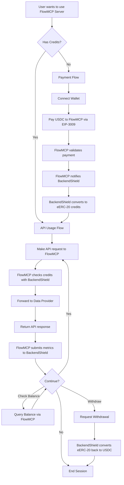
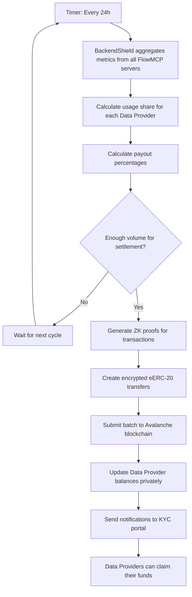

# BackendShield Flow Diagrams

## Overview
This document shows the user journey and automated Data Provider settlement process in the BackendShield credit-based payment system.

## User Flow Diagram

### Main Flow

### Data Provider Settlement (Automated Background Process)

## Flow Details

### 1. Initial Payment (One-time Setup)
- **Trigger**: User needs credits for first time
- **Process**: Standard EIP-3009 USDC authorization
- **Privacy**: Payment amount visible on blockchain (public)
- **Result**: User has encrypted eERC-20 credits

### 2. API Usage (Core Experience)
- **Trigger**: User makes API request
- **Authentication**: Signed messages (no repeated blockchain transactions)
- **Privacy**: Usage amounts and patterns encrypted
- **Performance**: Near-instant credit deduction

### 3. Credit Management
- **Balance Check**: Dedicated API route
- **Top-up**: Same as initial payment
- **Withdrawal**: Convert remaining eERC-20 back to USDC

### 4. Data Provider Compensation (Background)
- **Frequency**: Regular automated polling (24h cycles)
- **Privacy**: Payout amounts encrypted via ZK proofs
- **Distribution**: Based on actual usage metrics from FlowMCP servers
- **Claiming**: Data Providers use KYC web portal

## Key Privacy Features

| Component | Visibility | Privacy Level |
|-----------|------------|---------------|
| Initial USDC Payment | Public on blockchain | ❌ No privacy |
| Credit Balance | Server knows, blockchain encrypted | ✅ Private amounts |
| API Usage Patterns | Server tracks, blockchain encrypted | ✅ Private usage |
| Data Provider Payouts | BackendShield knows, blockchain encrypted | ✅ Private earnings |

## User Experience Benefits

1. **One Payment, Multiple Uses**: Pay once, use credits for many API calls
2. **No Wallet Prompts**: Only sign messages, no blockchain transactions during usage
3. **Transparent Pricing**: Always know credit costs upfront
4. **Privacy by Default**: Usage patterns hidden from external observers
5. **Easy Withdrawal**: Get remaining funds back anytime

## Technical Flow States

### User States
- `no_credits` → Requires payment
- `has_credits` → Can make API calls
- `insufficient_credits` → Needs top-up
- `withdrew_funds` → Session ended

### Server States
- `payment_received` → Converting to eERC-20
- `credits_issued` → Ready for API calls
- `processing_request` → Handling API call
- `logging_metrics` → Recording usage privately

### Data Provider States  
- `serving_requests` → Processing API calls via FlowMCP
- `metrics_collected` → Usage logged by BackendShield for payout
- `payout_calculated` → Ready for encrypted distribution
- `funds_claimable` → Available via KYC portal

This flow ensures maximum privacy while maintaining simplicity for users and fair compensation for Data Providers.